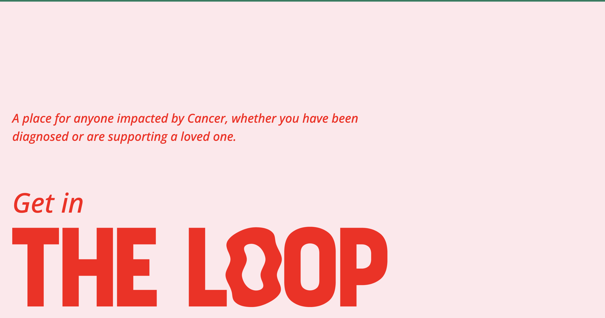
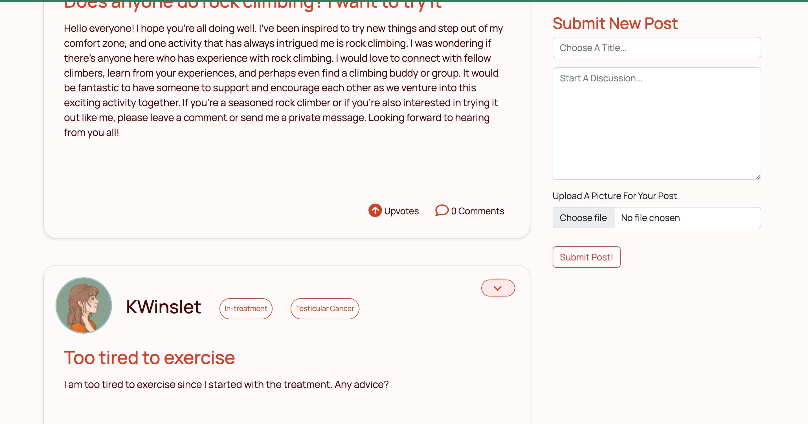
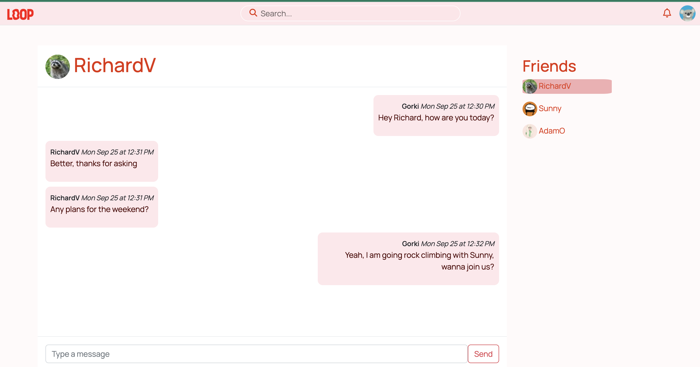

# TheLoop

## Description

A place for anyone impacted by Cancer, whether you have been diagnosed or are supporting a loved one.
Support Platform for cancer patients and family members who wants to share feelings, experiences and generally a safe space for people to connect.

The inspiration for this app sprang from deeply personal experiences within our team. We recognized there are no websites or online networks that truly catered to the needs of those battling this illness. There is a lot of misinformation and pseudo-science which makes hard to navigate the labyrinth of pseudo science and real experiences. 
The feeling of being alone and isolated in such a hardship is heartbreaking.

That's why we decided to create this platform, that it should no longer be a taboo subject. In fact, recent studies reveal that a staggering 1 in 2 men and women will confront this disease at some point in their lives.

Through a collaborative effort, we have build this social network, offering a platform for heartfelt conversations, the creation of insightful posts, and the sharing of deeply personal experiences.

The project was done in 2 weeeks while studying at Le Wagon Bootcamp as the final project.
Made on Ruby on Rails and Stimulus JS, using PostgreSQL for the database, Bootstraps for the SCSS and Websocket and Action Cable for a chatroom feature.

## Visuals

## Authors and acknowledgment
 InTheLoop was the final project made by TheLoop team while studying at Le Wagon bootcamp in London.
 
- [Gorka Echavarri](https://github.com/GorkaEchavarri)
- [Johnny Wordsworth](https://github.com/Wordeu)
- [Richard Vidor](https://github.com/rvidor)
- [Sunny Thapa](https://github.com/Sun-tha)
 
## License
Copyright 2023 TheLoop licensed under the GNU General Public License v3.0 Image assets are licensed under xxx
